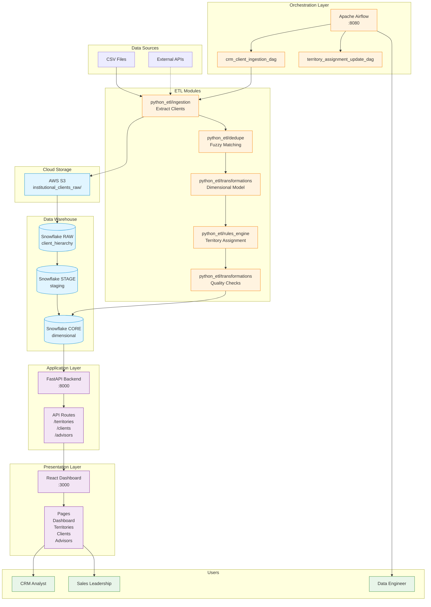

# System Architecture

## Overview

The Enterprise CRM Territory & Segmentation Engine is a multi-tier system designed for scalable territory management and client segmentation.

---

## Architecture Diagram



---

## Component Descriptions

### Data Sources Layer

**CSV Files**
- Mock client data for development
- Simulates CRM system exports
- Located in `data/mock_clients/`

**External APIs** (Future)
- Salesforce API integration
- Other CRM system integrations

### Cloud Storage Layer

**AWS S3**
- Landing zone for raw data files
- Timestamped paths: `YYYY/MM/DD/filename.csv`
- Server-side encryption (AES256)
- Bucket: `institutional-clients-raw`

### Data Warehouse Layer

**Snowflake RAW Database**
- Landing zone for ingested data
- Schema: `client_hierarchy`
- Table: `CLIENTS`
- Retention: 7 days

**Snowflake STAGE Database**
- Intermediate transformation layer
- Schema: `staging`
- Table: `CLIENTS_STAGING`
- Retention: 3 days

**Snowflake CORE Database**
- Final dimensional model (star schema)
- Schema: `dimensional`
- Tables:
  - `CLIENT_DIM` - Client dimension
  - `TERRITORY_DIM` - Territory dimension
  - `ASSIGNMENTS_FACT` - Assignment fact table
- Retention: 30 days

### Orchestration Layer

**Apache Airflow**
- Workflow orchestration
- DAG scheduling and monitoring
- Task dependency management
- Web UI for monitoring

**DAGs:**
1. `crm_client_ingestion_dag` - Main ETL pipeline
2. `territory_assignment_update_dag` - Nightly assignment updates

### ETL Modules

**Ingestion** (`python_etl/ingestion/`)
- Extract data from sources
- Upload to S3
- Load to Snowflake RAW

**Deduplication** (`python_etl/dedupe/`)
- Fuzzy matching using rapidfuzz
- Duplicate detection and merging
- Confidence scoring

**Transformation** (`python_etl/transformations/`)
- Build dimensional model
- Data quality checks
- Conflict detection

**Rules Engine** (`python_etl/rules_engine/`)
- Territory assignment logic
- Whitelist/blacklist rules
- Auto-segmentation tiers
- Priority-based evaluation

### Application Layer

**FastAPI Backend**
- RESTful API endpoints
- Automatic OpenAPI documentation
- CORS enabled for frontend
- Data access layer

**API Routes:**
- `/api/territories` - Territory management
- `/api/clients` - Client queries
- `/api/advisors` - Advisor workload
- `/api/assignments` - Assignment data
- `/api/health` - Health checks
- `/api/stats` - System statistics

### Presentation Layer

**React Dashboard**
- TypeScript + Vite
- shadcn/ui components
- Lucide icons
- Responsive design

**Pages:**
- Dashboard - Overview and metrics
- Territories - Territory management
- Clients - Hierarchy explorer
- Advisors - Workload monitoring

---

## Data Flow

### ETL Pipeline Flow

```
1. Extract → Read CSV files
2. Deduplicate → Fuzzy matching (85% threshold)
3. Upload → S3 with timestamped path
4. Load → Snowflake RAW.CLIENTS
5. Transform → Build dimensional model
6. Rules Engine → Assign territories
7. Quality Checks → Validate data
8. Load → Snowflake CORE tables
```

### API Request Flow

```
1. User → React Dashboard
2. Dashboard → API Request (axios)
3. API → Read from Snowflake/CSV
4. API → Transform data
5. API → Return JSON response
6. Dashboard → Render UI
```

---

## Security Architecture

### Role-Based Access Control

**DATA_ENGINEER**
- Full access to RAW, STAGE, CORE
- Can run ETL pipelines
- Can modify data

**CRM_ANALYST**
- Read access to CORE database
- Can query all tables
- Cannot modify data

**SALES_LEADERSHIP**
- Read access via secure views only
- Row-level security applied
- Cannot see raw data

### Secure Views

- `v_territory_summary` - Territory metrics
- `v_client_assignments` - Current assignments
- `v_advisor_workload` - Advisor metrics
- `v_regional_performance` - Regional stats
- `v_client_hierarchy` - Organizational structure
- `v_assignment_history` - Historical changes

---

## Scalability Considerations

### Horizontal Scaling

- **API**: Multiple instances behind load balancer
- **Frontend**: CDN for static assets
- **Airflow**: Celery executor with worker pool

### Vertical Scaling

- **Snowflake**: Increase warehouse size
- **Airflow**: Increase worker concurrency
- **API**: Increase uvicorn workers

### Performance Optimization

- **Caching**: Redis for API responses
- **Indexing**: Snowflake indexes on foreign keys
- **Partitioning**: Snowflake table partitioning by date
- **Compression**: Gzip for API responses

---

## Technology Stack

### Backend
- **Python 3.11** - Core language
- **Apache Airflow 2.7** - Workflow orchestration
- **FastAPI** - REST API framework
- **Pandas** - Data manipulation
- **rapidfuzz** - Fuzzy matching

### Data Storage
- **Snowflake** - Cloud data warehouse
- **AWS S3** - Object storage
- **SQLite** - Local development (Airflow)

### Frontend
- **React 18** - UI framework
- **TypeScript** - Type safety
- **Vite** - Build tool
- **shadcn/ui** - Component library
- **Lucide** - Icon library
- **Recharts** - Data visualization

### DevOps
- **Docker** - Containerization
- **Docker Compose** - Multi-container orchestration
- **nginx** - Web server and reverse proxy

---

## Design Decisions

### Why Snowflake?
- Enterprise-grade data warehouse
- Separation of storage and compute
- Built-in security and governance
- SQL-based transformations

### Why Airflow?
- Industry standard for ETL orchestration
- DAG-based workflow definition
- Rich monitoring and logging
- Extensible with Python

### Why FastAPI?
- Automatic API documentation
- Type validation with Pydantic
- High performance (async)
- Modern Python features

### Why React + shadcn/ui?
- Component-based architecture
- Type-safe with TypeScript
- Beautiful, accessible UI components
- Responsive design out of the box

---

## Future Enhancements

1. **Real-time Updates**
   - WebSocket connections
   - Live dashboard updates

2. **Advanced Analytics**
   - Machine learning for territory optimization
   - Predictive client segmentation

3. **Mobile App**
   - React Native mobile client
   - Offline support

4. **Advanced Security**
   - OAuth 2.0 authentication
   - API rate limiting
   - Audit logging

---

**Document Version**: 1.0
**Last Updated**: December 2025
